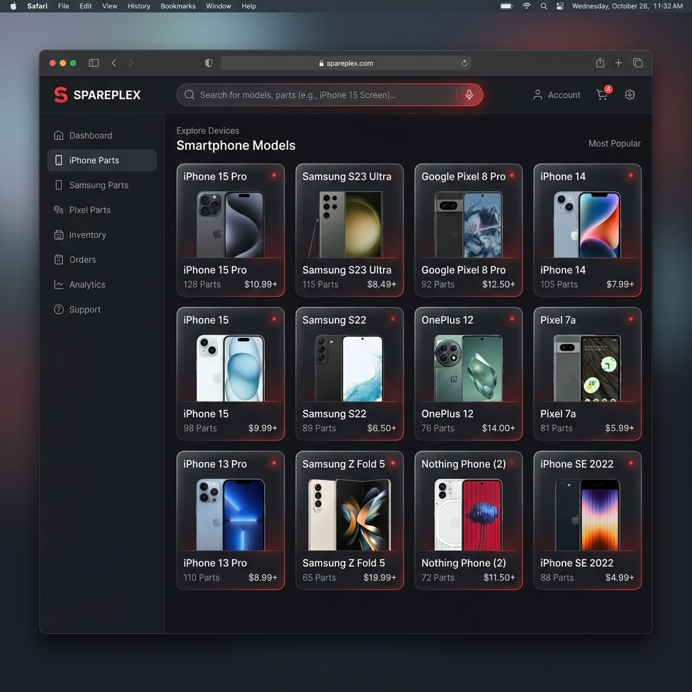

<div align="center">
  
  <br/>
  <h1>GlyphParts v1.0</h1>
  <p><strong>The Independent Archive for Nothing & CMF Spare Parts Pricing</strong></p>
  
  [](https://vercel.com/new)
  [](https://reactjs.org/)
  [](https://tailwindcss.com/)
  [](#)
</div>

---

## 📱 About GlyphParts

GlyphParts is a fast, offline-capable Progressive Web Application (PWA) designed to provide accurate, up-to-date, and transparent pricing for original spare parts of Nothing and CMF smartphones. 

Built with the core principle of **Ship. Observe. Improve.**, this independent resource aims to help the community estimate repair costs without relying on slow or hard-to-navigate official portals.

<div align="center">
  
</div>

## ✨ Highlights & Features

- **Blazing Fast Search:** Find any component or device instantly with fuzzy-matching, keyboard shortcuts (⌘K), and Voice Search.
- **Offline Mode (PWA):** Install the app directly to your home screen. Our Service Worker ensures full offline capability.
- **Service Center Locator:** Privacy-first calculation to find the nearest official repair center without relying on commercial tracking.
- **Dark & Light Themes:** Perfectly balanced semantic themes to match your system preferences.
- **Community Sourced Accuracy:** Built-in "Report Incorrect Price" pipelines allow the community to verify data.
- **Device Comparisons:** Side-by-side technical specifications and component price comparisons.

## 🛠 Tech Stack

- **Framework:** React 19 + Vite
- **Styling:** TailwindCSS v4
- **Routing:** React Router v7
- **Animations:** Framer Motion
- **Icons:** Lucide React
- **PWA:** Vite PWA Plugin
- **Maps:** Leaflet & React-Leaflet (OpenStreetMap)

## 🚀 Run Locally

**Prerequisites:** Node.js (v18+)

1. Clone the repository:
   ```bash
   git clone https://github.com/Tamanash-009/GlyphParts.git
   cd GlyphParts
   ```

2. Install dependencies:
   ```bash
   npm install
   ```

3. Run the development server:
   ```bash
   npm run dev
   ```

## 🌍 Production Build

To test the production build locally including the generated PWA service workers and sitemap:

```bash
npm run build
npm run preview
```

## ⚖️ Disclaimer

GlyphParts is strictly an informational index and archive. We do not sell hardware, supply spare components, or operate commercial repair facilities. All displayed price tables are strictly model-wise original pricing for informative indexing purposes. Prices do not include labor or taxes.

---

<div align="center">
  <p>Built for the Community.</p>
</div>
